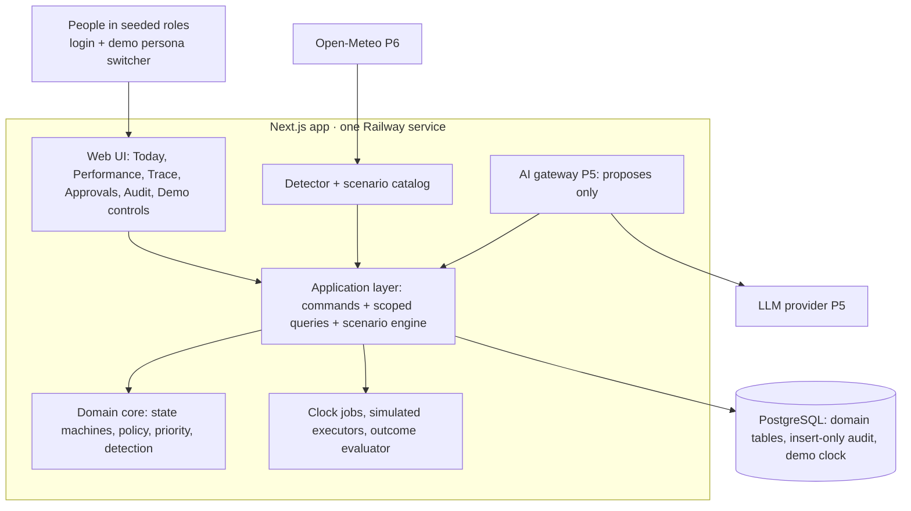

# Architecture

Status: describes the system as built at the end of Phase 2. Later-phase parts are marked with their phase.
Decisions: ADR-001 (stack), ADR-002 (hosting), ADR-003 (authorization), ADR-004 (audit), ADR-005 (priority),
ADR-006 (workstreams and local priority).

## Components

| Layer                 | Folder            | May import                | Never imports                        |
| --------------------- | ----------------- | ------------------------- | ------------------------------------ |
| Domain                | `src/domain`      | nothing outside itself    | Next, React, pg, Drizzle, infra, app |
| Application           | `src/application` | domain, infra             | app (UI)                             |
| Infrastructure        | `src/infra`       | domain types              | app                                  |
| UI and route handlers | `src/app`         | application, domain types | DB (`@/infra/db`, pg, Drizzle)       |

The boundaries are enforced by ESLint (`no-restricted-imports`) for the domain, the application layer and UI
components (`src/app/**/*.tsx`). The rule does not cover `.ts` files under `src/app`: server actions and the session
helper import `@/infra/auth` (Better Auth), and `/api/health` uses the DB pool directly for its health query.

The UI reaches the application only through `src/application/facade.ts`, which binds the database and the active
organization to the queries and commands. Server actions in `src/app/actions.ts` re-derive the actor from the session
on every call.

## UI (Phase 3)

Dark theme, sidebar navigation (top bar on small screens). Every page requires sign-in.

| Route                      | What it shows                                                                                                                                                                 | Who                                                          |
| -------------------------- | ----------------------------------------------------------------------------------------------------------------------------------------------------------------------------- | ------------------------------------------------------------ |
| `/login`                   | Sign-in form; demo persona list when `DEMO_PERSONAS=on`                                                                                                                       | everyone                                                     |
| `/`                        | Home dashboard of your scope (G-P3a): headline, waiting on you, KPIs, risk/opportunity summary, dependencies, position extras                                                 | anyone with `insight.read`                                   |
| `/risks`, `/opportunities` | The workstream's full ranked list for your scope or `?unit=` (out of scope → 404), band filter, recently resolved                                                             | anyone with `insight.read`                                   |
| `/commitments`             | Commitment register for your scope (or `?unit=`; out of scope → 404): record (conflict rules run at once), complete, renegotiate, cancel; dependencies both ways; bottlenecks | managers (record/update), anyone with `insight.read` (read)  |
| `/actions`                 | Action tracker for your scope with filters; outcomes by stage with the review form; lessons library ("Last time we did this" on traces)                                       | anyone with `insight.read`; reviewing needs `outcome.review` |
| `/units/[id]`              | Unit view (group, region, branch, department): breadcrumb, KPIs linked to insights, lanes by local priority, actions, dependencies                                            | anyone whose scope covers the unit; else 404                 |
| `/org`                     | Hierarchy in scope, with each unit's worst band and counts; departments owns / involved                                                                                       | anyone with `insight.read`                                   |
| `/performance`             | Redirect to Home                                                                                                                                                              | anyone with `insight.read`                                   |
| `/insights/[id]`           | Trace: signals, evidence, priority breakdown, decision, actions, approvals, outcome, and the insight's audit trail. Out of scope = 404                                        | anyone who can read it                                       |
| `/approvals`               | Waiting on you: decisions to make, approvals the viewer is routed (grant or deny), the viewer's own actions                                                                   | anyone                                                       |
| `/audit`                   | Scoped audit explorer: events whose subject you may read (Executive and Admin: everything, incl. resets and clock), plus your own refusals; filters; chain status             | anyone with `audit.read` (Executive, Admin, managers)        |
| `/admin/demo`              | Advance the demo clock; reset the demo into a new epoch                                                                                                                       | Admin (`demo.control`)                                       |

Every server action validates its input with Zod (`src/application/inputs.ts`) before calling a command; invalid input is
an audited-style domain refusal (`Invalid`). The UI exposes accept/decline decision, grant/deny approval and review outcome. The other human commands
(acknowledge, dismiss, cancel, amend, retry) exist in the application layer and arrive in the UI with the unit views
in Phase 3. A scoped audit explorer arrives in Phase 4.

## Command pipeline

Every state-changing request follows one path (`runCommand` in `src/application/context.ts`):

1. **Authenticate**: session → `Actor` (user with role assignments, or a system actor).
2. **Check the input**: by TypeScript type and by explicit guards in the command (rationale required, known action
   type, clock-advance range). Zod validation at the command boundary arrives with the Phase 3 API; in Phase 2 Zod validates only
   the runtime configuration (`src/infra/config.ts`).
3. **Begin transaction**; load the target entity `FOR UPDATE`.
4. **Authorize** (`domain/policy/authorize`): permission + scope + context rules.
5. **Transition** (pure domain table and guards): illegal transitions throw `IllegalTransition`.
6. **Persist** the entity changes and the `audit_event` rows (advisory lock + hash chain) in the same transaction.
7. **Commit.** A refused command rolls back, and its `<operation>.denied` row is written in a separate transaction.

Follow-up work runs **synchronously, in the same request**, not from a queue: after a decision is accepted or an
approval granted, the facade runs `executeReadyActions`. Reads go through scoped query functions that filter by the
actor's visible units in SQL.

## Background work

There is no job queue in Phase 2 (pg-boss was the plan; it is not installed). The jobs are plain functions:

- `runClockJobs`: expire approval requests after 72 h and lapse unused approvals after 7 days (`system:clock`).
- `executeReadyActions`: the simulated executors for every `ready` action (`system:executor`).
- `evaluateDueOutcomes`: verdicts for outcome windows that have closed, then resolve insights whose loop closed
  (`system:outcome-evaluator`).
- `runDetector`: the KPI deviation detector over all branches for the clock's day (`system:detector`).

The demo scenario engine (`src/application/scenario.ts`) runs them: `advanceClock` generates the synthetic KPI data
for the elapsed days, advances the clock, then runs the clock jobs, the executor, the evaluator and (when the day
changed) the detector; `resetDemo` seeds a new epoch, runs the detector and loads the scenario catalog. Nothing runs
them on a timer, so outside the demo controls approvals do not expire on their own. A scheduler (pg-boss or a Railway
cron service) remains an option for a later phase, when real time matters.

## Time

`Clock` is injected everywhere in the domain. Commands read the organization's DB-persisted demo clock
(`demo_clock`, falling back to real time if none is set) once per request; the scenario engine advances it. Audit rows
keep both `occurred_at` (domain clock) and `recorded_at` (real time).

## Demo epochs

A demo reset never deletes data. It creates a new `organization` (an "epoch"), seeds it, and marks it active; older
epochs and their audit chains stay intact and are still verified by `pnpm run doctor`. Every query and command works
on the active organization.

## Environments and deploy

See ADR-002 and the README. `main` → Dev automatically; `demo` branch → demo after sign-off. On Railway the service
starts with `pnpm start:railway`: migrate, create the `vector_app` role if `APP_DB_PASSWORD` is set, seed a demo epoch
if none carries the current seed version, then start. `/api/health` reports the build SHA, DB status, migrations and
the active epoch's seed version and risk and opportunity counts; `pnpm smoke --expect-sha` verifies a deploy.
