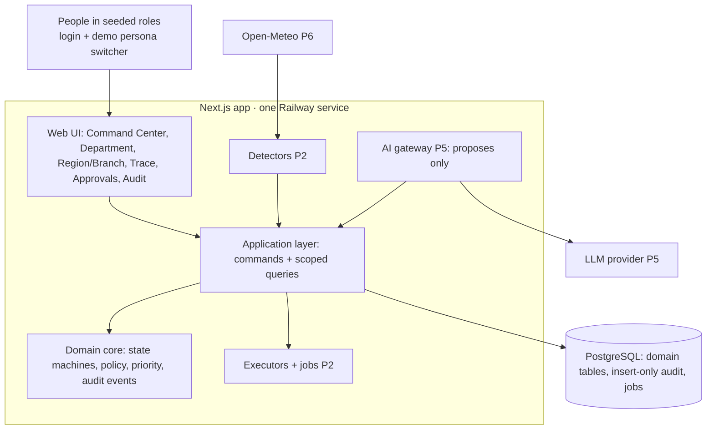

# Architecture

Status: describes the system as built at the end of Phase 0, plus the Phase 2 target (marked **P2**). Decisions:
ADR-001 (stack), ADR-002 (hosting), ADR-003 (authorization), ADR-004 (audit), ADR-005 (priority).

## Components

| Layer                 | Folder            | May import                | Never imports                        |
| --------------------- | ----------------- | ------------------------- | ------------------------------------ |
| Domain                | `src/domain`      | nothing outside itself    | Next, React, pg, Drizzle, infra, app |
| Application           | `src/application` | domain, infra             | app (UI)                             |
| Infrastructure        | `src/infra`       | domain types              | app                                  |
| UI and route handlers | `src/app`         | application, domain types | DB (`@/infra/db`, pg, Drizzle)       |

The boundaries are enforced by ESLint (`no-restricted-imports`).

## Command pipeline (P2)

Every state-changing request follows one path:

1. **Authenticate**: session → `Actor` (user with role assignments, or a system actor).
2. **Validate** the input with Zod.
3. **Begin transaction**; load the target entity `FOR UPDATE`.
4. **Authorize** (`domain/policy/authorize`): permission + scope + context rules. A denial is audited and returned.
5. **Transition** (pure domain function): `(entity, command, actor, policy, clock) → { next, events } | DomainError`.
6. **Persist** the entity changes and the `audit_event` rows (advisory lock + hash chain) in the same transaction.
7. **Commit**, then enqueue follow-up jobs (pg-boss): execute a ready action, schedule an outcome evaluation.

Reads go through scoped query functions that filter by the actor's visible units in SQL.

## Background work (P2)

pg-boss in-process (same service) runs the detector schedule, executors, outcome evaluator and the clock
jobs (approval expiry/lapse). The demo scenario engine drives the same jobs with the demo clock. It moves to a
separate Railway worker service only if load or isolation requires it.

## Time

`Clock` is injected everywhere in the domain. Production uses the system clock; the demo environment uses a
DB-persisted demo clock that the scenario engine can advance. Audit rows keep both `occurred_at` (domain clock) and
`recorded_at` (real time).

## Environments and deploy

See ADR-002 and the README. `main` → Dev automatically; `demo` branch → demo after sign-off. `/api/health` reports the
build SHA, DB status and migrations; `pnpm smoke --expect-sha` verifies a deploy.
