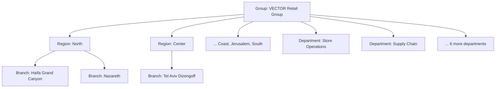
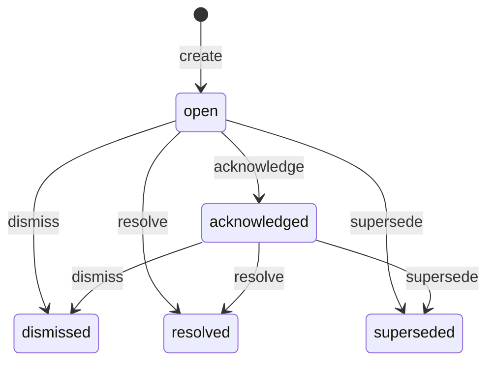
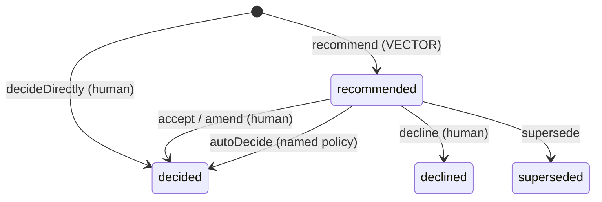
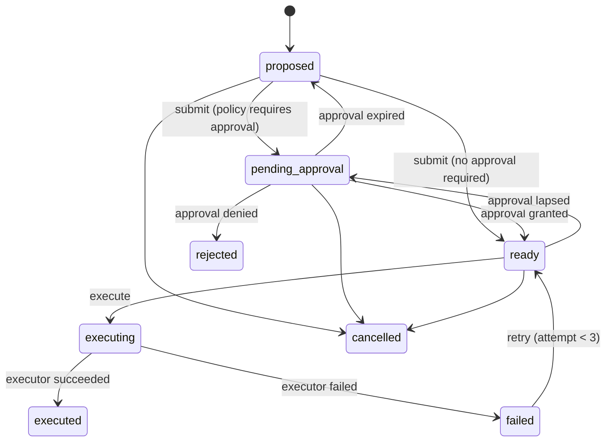
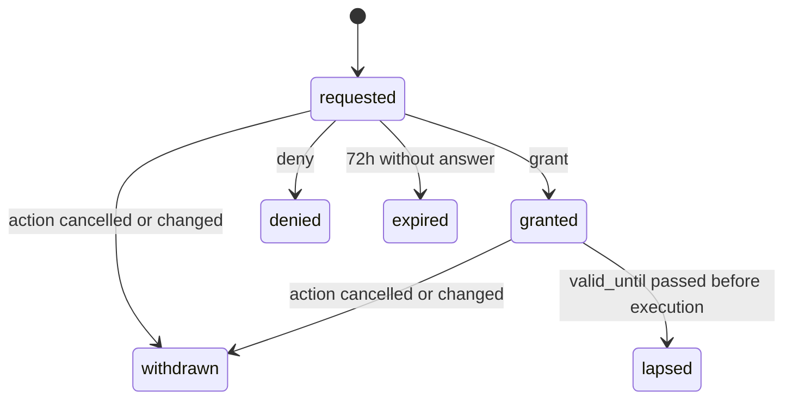
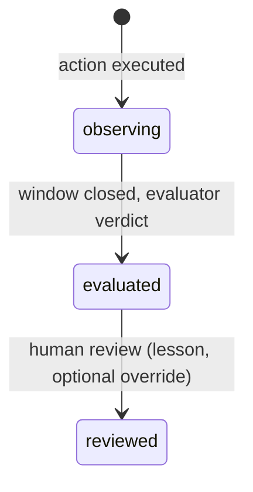

# Domain model and lifecycle

Status: **Approved (Phase 1, 2026-10-04); updated for Phase 2 as built.** The transition tables below are the
source for `src/domain/lifecycle/machines.ts`; every row is a unit test case. Where a row exists in the domain but
no command uses it yet, the table says so.

VECTOR's model is the lifecycle **Signal → Insight → Decision → Action → Outcome**, placed in an
organization and wrapped by governance records (Evidence, Approval, AuditEvent). Entities are introduced
only when a phase needs them (charter §25).

## 1. Organization

The seeded organization (`src/infra/seed/org.ts`, seed version `p2-v4`) has 5 regions (North, Coast, Center,
Jerusalem, South) of 12 branches each (60 branches) and 8 departments (Store Operations, Supply Chain, Trade &
Commercial, Marketing, Finance, HR, Legal & Compliance, IT), plus 20 people.

| Entity           | Purpose                                                                                                                       | Key fields                                                                                                              | Phase |
| ---------------- | ----------------------------------------------------------------------------------------------------------------------------- | ----------------------------------------------------------------------------------------------------------------------- | ----- |
| `Organization`   | Tenant boundary. Every row carries `org_id`. A demo reset creates a new organization ("epoch") and deactivates the old one    | name, is_active, seed_version                                                                                           | P2    |
| `OrgUnit`        | Node in one tree: `group`, `region`, `branch`, `department`                                                                   | type, parent_id, name, code, city, lat/lon, size_class, path_ids (the unit and its ancestors, used for scope checks)    | P2    |
| `User`           | A person who signs in (Better Auth table plus our fields)                                                                     | name, email, title, org_id, is_seeded                                                                                   | P2    |
| `RoleAssignment` | A role held at an org unit; scope = that unit's subtree                                                                       | user_id, role, org_unit_id                                                                                              | P2    |
| `Kpi`            | Metric definition                                                                                                             | code, name, unit, higher_is_better, strategic_weight 0–1, owner_department_id, level (`branch` or `department`), target | P2    |
| `KpiObservation` | One value of a KPI for a unit and day. Branch KPIs are observed per branch; department KPIs once a day on the department unit | kpi_id, org_unit_id, day, value, source                                                                                 | P2    |

The seed defines 16 KPIs: 6 branch KPIs (net sales, transactions, on-shelf availability, labor %, shrinkage %, NPS)
and 10 department KPIs observed on their owning department, each with a target.

Branches belong to regions. Departments sit under the group and relate to branches through **service
relationships** (Supply Chain serves all branches). In Phase 4 these become explicit `Dependency` rows; until then
an insight lists departments among its affected units, and names the department that owns the response in
`owner_department_id`.

## 2. Lifecycle entities

| Entity       | What it is                                                      | Key fields                                                                                                                                                                                                                                                                                                                                                                                                                                                                                    | Mutable?        |
| ------------ | --------------------------------------------------------------- | --------------------------------------------------------------------------------------------------------------------------------------------------------------------------------------------------------------------------------------------------------------------------------------------------------------------------------------------------------------------------------------------------------------------------------------------------------------------------------------------- | --------------- |
| `Signal`     | A fact: something changed or was observed                       | type (`kpi_deviation` from the live detector; the scenario catalog also uses `commitment_overdue`, `dependency_delay`, `decision_conflict`, `external_event`, `incident`, `facility_review`), source, detector + detector_version, observed_at, primary_unit_id, measurements (JSON), dedupe_key                                                                                                                                                                                              | **Immutable**   |
| `Evidence`   | Frozen snapshot of data that supports a claim                   | kind (`kpi_series`, `source_record` in Phase 2), title, source_ref, captured_at, payload (JSON), payload_hash (sha256 of canonical JSON)                                                                                                                                                                                                                                                                                                                                                      | **Immutable**   |
| `Insight`    | Interpretation of one or more signals in organizational context | workstream (`risk` or `opportunity`, ADR-006), title, what_happened, why_it_matters, primary_unit_id, affected_unit_ids[], owner_department_id, visible_unit_ids[], signal_ids[], evidence_ids[], confidence 0–1, priority_score, priority_band (P1–P4 for risks, O1–O3 for opportunities), priority_breakdown (JSON), priority_model_version (`priority-v2` or `opportunity-v1`), generated_by (`rule:kpi-deviation@1`, `scenario-catalog@1`; later `ai:<generation_id>`), status, rationale | State machine   |
| `Decision`   | What the organization chose to do about an insight              | insight_id, statement, rationale, origin (`vector_recommended`, `human_authored`), status, decided_by (user id or `policy:AD-1`), decided_at, auto_rule                                                                                                                                                                                                                                                                                                                                       | State machine   |
| `Action`     | A concrete response with an owner                               | decision_id, insight_id, type, title, owner_user_id, proposed_by, target_unit_ids[], visible_unit_ids[], due_at, estimated_cost, executor (`internal_task`, `outbox_message`), params (JSON), approval_requirement (JSON: policy version and every rule evaluated, matched or not, with eligible approvers), idempotency_key, status, attempt, revision, result                                                                                                                               | State machine   |
| `Approval`   | One explicit human answer on one action revision                | action_id, action_revision, requirement (JSON, copied from the action), requested_at, approver_user_id, rationale, decided_at, valid_until, status (the verdict is the status: `granted` or `denied`)                                                                                                                                                                                                                                                                                         | State machine   |
| `Outcome`    | What happened after the action                                  | action_id, insight_id, kpi_id, unit_ids[], expected_direction, expected_threshold, baseline (JSON), window_start, window_end, observed (JSON), evidence_ids[], verdict, verdict_by (`outcome-evaluator@v1`), lesson, status                                                                                                                                                                                                                                                                   | State machine   |
| `AuditEvent` | Append-only record of every state change                        | see [authorization.md §6](authorization.md#6-audit-event)                                                                                                                                                                                                                                                                                                                                                                                                                                     | **Insert-only** |

Every mutable row also carries `version` (incremented on each change). Simulated executor output lives in `task` and
`outbox_message` (D7), and the demo clock in `demo_clock` (one row per organization).

Phase 4 adds (docs/phases/PHASE_4.md):

| Entity       | What it is                                                   | Key fields                                                                                                                                                                                                                                                                    | Lifecycle     |
| ------------ | ------------------------------------------------------------ | ----------------------------------------------------------------------------------------------------------------------------------------------------------------------------------------------------------------------------------------------------------------------------- | ------------- |
| `Commitment` | A promise by a unit, owned by a person, to deliver by a date | title, owner_user_id, owner_unit_id, beneficiary_unit_ids[], source, made_at, due_at, impact_ils (per week if late), compliance (0–1), effects[] ({resource, effect, window_start, window_end}), insight_id, completed_at, history (renegotiations), visible_unit_ids, status | State machine |
| `Dependency` | A unit needs a commitment by a date                          | commitment_id (upstream), downstream_unit_id, downstream_commitment_id (optional: the downstream promise that relies on it), need_by, impact_ils, note. **Status is derived, never stored** (Q4): `met`, `waiting`, `at_risk`, `blocked`                                      | Derived       |
| `Conflict`   | Two commitments whose effects collide                        | commitment_a_id, commitment_b_id, rule (`conflict-rules-v1` pair), resource, overlap_start, overlap_end, insight_id, status (`open`, `resolved`), resolved_reason                                                                                                             | State machine |

Later phases add `AiGeneration` (P5) and `ExternalItem` (P6).

## 3. Rules that hold everywhere

1. **No hidden transitions.** A state field changes only inside a named command (`src/application/commands`).
   The command checks authorization, applies the domain transition, and writes the entity change and its
   `AuditEvent` in the **same transaction**. There is no other write path, and code review rejects one.
   A refused attempt (permission, authorization or illegal transition) is audited as `<operation>.denied` in its own
   transaction, because the command's transaction rolls back.
2. **The domain decides; infrastructure persists.** The transition tables (`transition(machine, from, command)`) and
   the guards (`src/domain/lifecycle/guards.ts`) are pure functions in `src/domain`. Commands load the entity
   `FOR UPDATE`, call them, and persist the result.
3. **Evidence is frozen.** An insight cites evidence snapshots, never live queries.
4. **Decision origin is explicit and displayed:** recommended by VECTOR, made by a human, or decided by a
   named automatic policy. It is never inferred from other fields.
5. **Approval is a record, not a flag.** An action that needs approval can execute only if a `granted`, unexpired
   `Approval` exists for that exact action revision.
6. **Time is injected.** Every timestamp in the domain comes from the `Clock`; commands read the demo clock once per
   request, and the demo clock can be advanced.

## 4. State machines and transition tables

Notation: **Actor** = the capability required (see [authorization.md](authorization.md)) or a system actor.
**Guard** = conditions checked by the domain or policy. **Audit** = `operation` written to `AuditEvent`.
Any transition not listed is **rejected** with `IllegalTransition` and audited as a denied attempt.
**Command** names the function in `src/application/commands` that performs the row; _none yet_ means the row exists in
the domain machine (and its unit test) but no application command uses it in Phase 2.

### 4.1 Insight

| #   | From → To                      | Command                                                                   | Actor                                              | Guard                                                                                                                                  | Audit                  |
| --- | ------------------------------ | ------------------------------------------------------------------------- | -------------------------------------------------- | -------------------------------------------------------------------------------------------------------------------------------------- | ---------------------- |
| I1  | ∅ → open                       | `recordDetection`                                                         | `system:detector` (P2), `system:ai` (P5)           | ≥1 signal, evidence attached, priority computed (risk or opportunity model)                                                            | `insight.created`      |
| I2  | open → acknowledged            | `acknowledgeInsight`                                                      | `insight.acknowledge`                              | actor's scope contains primary unit                                                                                                    | `insight.acknowledged` |
| I3  | open/acknowledged → dismissed  | `dismissInsight` (no UI yet)                                              | `insight.dismiss`                                  | rationale required; no action in `pending_approval`/`ready`/`executing`                                                                | `insight.dismissed`    |
| I4  | open/acknowledged → resolved   | inside `evaluateDueOutcomes` (system); human `resolveInsight`: _none yet_ | `system:outcome-evaluator`; `insight.resolve` (P3) | no decision still `recommended`, no action in `proposed`/`pending_approval`/`ready`/`executing`, ≥1 outcome and none still `observing` | `insight.resolved`     |
| I5  | open/acknowledged → superseded | _none yet_                                                                | `system:detector`                                  | the new insight covers all signals of the old one                                                                                      | `insight.superseded`   |

Signal deduplication (inside `recordDetection`): a signal whose `dedupe_key` matches a signal of an open or
acknowledged insight **attaches** to it (audit `insight.signal_attached`) and recomputes priority (audit
`insight.reprioritized` with the score and band before and after, written only when the score changed).

Because I4 needs at least one evaluated outcome, an insight whose actions measure nothing (for example only
`notify_owner`) does not resolve automatically; it waits for the human resolve command (Phase 3).

### 4.2 Decision

| #   | From → To                | Command                               | Actor                               | Guard                                                                                                                           | Audit                                    |
| --- | ------------------------ | ------------------------------------- | ----------------------------------- | ------------------------------------------------------------------------------------------------------------------------------- | ---------------------------------------- |
| D1  | ∅ → recommended          | inside `recordDetection`              | `system:detector`, `system:ai` (P5) | created with the insight; includes ≥1 proposed action                                                                           | `decision.recommended`                   |
| D2  | ∅ → decided              | `decideDirectly`: _none yet_ (P3)     | `decision.decide`                   | scope contains insight primary unit; rationale required; `origin=human_authored`                                                | `decision.decided`                       |
| D3  | recommended → decided    | `acceptDecision` (optional rationale) | `decision.decide`                   | scope contains insight primary unit; who and when recorded. Amending the statement or actions while accepting is not built (P3) | `decision.decided`                       |
| D4  | recommended → decided    | `autoDecide` (no caller yet)          | `system:policy`                     | an automatic-decision rule (AD-n) matches **and** every resulting action has an empty approval requirement                      | `decision.auto_decided` (rule id)        |
| D5  | recommended → declined   | `declineDecision`                     | `decision.decide`                   | rationale required; the decision's `proposed` actions are cancelled in the same transaction                                     | `decision.declined` + `action.cancelled` |
| D6  | recommended → superseded | _none yet_                            | `system:detector`                   | insight superseded                                                                                                              | `decision.superseded`                    |

Automatic-decision rules (P2 has exactly one):

- **AD-1:** for P3/P4 insights, auto-decide the recommended "notify owner" decision. It only creates an
  `internal_task` informing the unit owner, which needs no approval. P1/P2 insights are **never** auto-decided.
  The command and its guard exist and are tested; nothing calls `autoDecide` in Phase 2, so every decision in the
  demo is made by a person.

### 4.3 Action (where human control matters most)

| #   | From → To                                   | Command                                                                          | Actor                                                                              | Guard                                                                                                                                                   | Audit                                                   |
| --- | ------------------------------------------- | -------------------------------------------------------------------------------- | ---------------------------------------------------------------------------------- | ------------------------------------------------------------------------------------------------------------------------------------------------------- | ------------------------------------------------------- |
| A1  | ∅ → proposed                                | inside `recordDetection`; human `proposeAction`: _none yet_ (P3)                 | `system:detector`/`system:ai` (as part of a recommendation); `action.propose` (P3) | decision exists; owner set; type is a known playbook                                                                                                    | `action.proposed`                                       |
| A2  | proposed → pending_approval                 | `submitActions` (internal, run by `acceptDecision`, `autoDecide`, `amendAction`) | `system:policy` (when its decision becomes `decided`)                              | approval policy evaluated **at submit time**; result stored in `approval_requirement`; an `Approval(requested)` is created                              | `action.submitted` + `approval.requested`               |
| A3  | proposed → ready                            | same as A2                                                                       | same as A2                                                                         | policy returns no requirement (rules evaluated and listed, all "not matched")                                                                           | `action.submitted` (requirement: none, rules evaluated) |
| A4  | pending_approval → ready                    | via `grantApproval` (§4.4)                                                       | `action.approve`                                                                   | see P2 guards                                                                                                                                           | `action.approved`                                       |
| A5  | pending_approval → rejected                 | via `denyApproval`                                                               | `action.approve`                                                                   | rationale required                                                                                                                                      | `action.rejected`                                       |
| A6  | pending_approval → proposed                 | via `runClockJobs`                                                               | `system:clock`                                                                     | request older than 72 h (demo clock). **Silence never approves**                                                                                        | `action.approval_expired`                               |
| A7  | ready → executing                           | `executeAction` (run by `executeReadyActions`)                                   | `system:executor` or `action.execute`                                              | **run-time check:** if the action needs approval, a `granted` approval exists for the current revision and `valid_until` > now. See the known gap below | `action.execution_started`                              |
| A8  | executing → executed                        | inside `executeAction`                                                           | `system:executor`                                                                  | executor result stored                                                                                                                                  | `action.executed`                                       |
| A9  | executing → failed                          | inside `executeAction`                                                           | `system:executor`                                                                  | error stored                                                                                                                                            | `action.failed`                                         |
| A10 | failed → ready                              | `retryAction` (no UI yet)                                                        | `action.execute`                                                                   | attempt < 3                                                                                                                                             | `action.retried`                                        |
| A7b | ready → pending_approval                    | _none yet_ (P3)                                                                  | `system:executor`                                                                  | policy re-evaluated at run time requires more than was approved                                                                                         | `action.requirement_grew`                               |
| P6b | ready → pending_approval                    | via `runClockJobs` (with P6)                                                     | `system:clock`                                                                     | the granted approval lapsed before execution; a new request is created                                                                                  | `approval.lapsed` + `approval.requested`                |
| A12 | proposed/pending_approval/ready → proposed  | `amendAction` (no UI yet)                                                        | `action.propose`                                                                   | cost or params change; revision +1; open approval withdrawn (P5b); re-submitted if the decision is decided. Targets cannot be amended yet               | `action.amended`                                        |
| A11 | proposed/pending_approval/ready → cancelled | `cancelAction` (no UI yet)                                                       | `action.cancel` (scope over every target unit)                                     | rationale required; open approval → `withdrawn`                                                                                                         | `action.cancelled`                                      |

`executeAction` performs A7 and A8 (or A9) in one transaction, so `executing` is recorded in the audit trail but is
never left persisted on the row.

**A7b (implemented 2026-10-04, known issue #2):** at execution the approval policy is re-run with today's facts
(insight band, org, owning department). If it now matches a rule the approval did not cover (e.g. the insight escalated
to P1), the granted approval is withdrawn (P5b), the action returns to `pending_approval` with the new requirement, and a
new request is raised, each step audited by `system:policy`; execution returns `{ reRequested }` instead of running.
A7 then checks the approval is still granted, for the same revision, and not lapsed. On a lapse (P6b) the action's move
back is audited (`action.approval_lapsed`) and the re-request is made by `system:policy`.

Executors in the prototype (D7) are **simulated and labelled**: `internal_task` creates a task visible in VECTOR,
and `outbox_message` writes a message to the visible outbox instead of sending it. Action types and their executor,
budget department (AP-3) and outcome measurement are defined in `src/application/playbooks.ts` (16 types in Phase 2).

### 4.4 Approval

| #   | From → To             | Command                                | Actor            | Guard                                                                                                                                                                                                                                                           | Audit                                                                     |
| --- | --------------------- | -------------------------------------- | ---------------- | --------------------------------------------------------------------------------------------------------------------------------------------------------------------------------------------------------------------------------------------------------------- | ------------------------------------------------------------------------- |
| P1  | ∅ → requested         | inside `submitActions`                 | `system:policy`  | —                                                                                                                                                                                                                                                               | `approval.requested`                                                      |
| P2  | requested → granted   | `grantApproval`                        | `action.approve` | actor is a person (AZ-4); approver is eligible under **every** matched approval rule (authorization.md §4); approver ≠ proposer; approver ≠ action owner; approval is for the current action revision; explicit click, rationale optional; switcher use flagged | `approval.granted`                                                        |
| P3  | requested → denied    | `denyApproval`                         | `action.approve` | same guards; rationale **required**                                                                                                                                                                                                                             | `approval.denied`                                                         |
| P4  | requested → expired   | `runClockJobs`                         | `system:clock`   | now − requested_at > 72 h                                                                                                                                                                                                                                       | `approval.expired`                                                        |
| P5  | requested → withdrawn | inside `cancelAction` or `amendAction` | —                | —                                                                                                                                                                                                                                                               | `approval.withdrawn`                                                      |
| P5b | granted → withdrawn   | inside `cancelAction` or `amendAction` | —                | an approval binds to one action revision                                                                                                                                                                                                                        | `approval.withdrawn`                                                      |
| P6  | granted → lapsed      | `runClockJobs`                         | `system:clock`   | valid_until (granted_at + 7 days) passed and the action is still `ready`                                                                                                                                                                                        | `approval.lapsed`; action → pending_approval with a new request (row P6b) |

An approval belongs to **one action revision**. If an action's params or cost change after approval, the approval
is withdrawn and a new one is requested. A previous approval of a _similar_ action never counts.

### 4.5 Outcome

| #   | From → To             | Command                | Actor                      | Guard                                                                                                                                                                        | Audit                                                                                       |
| --- | --------------------- | ---------------------- | -------------------------- | ---------------------------------------------------------------------------------------------------------------------------------------------------------------------------- | ------------------------------------------------------------------------------------------- |
| O1  | ∅ → observing         | inside `executeAction` | `system:executor`          | the action's playbook defines a metric, expected direction, threshold and window (in Phase 2 only `inventory_transfer`: on-shelf availability +5 points, 7 days)             | `outcome.watch_started`                                                                     |
| O2  | observing → evaluated | `evaluateDueOutcomes`  | `system:outcome-evaluator` | window_end ≤ now; window observations frozen as evidence                                                                                                                     | `outcome.evaluated` (verdict: `worked`, `partially_worked`, `did_not_work`, `inconclusive`) |
| O3  | evaluated → reviewed  | `reviewOutcome`        | `outcome.review`           | scope contains every outcome unit; a lesson is required; an override of the verdict needs a rationale and keeps the original verdict in audit (the UI records a lesson only) | `outcome.reviewed`                                                                          |

Verdict rule (deterministic, P2): compare the mean of the metric over the window with the baseline (the mean of the
7 days before execution). `worked` if the change in the expected direction is ≥ the threshold; `partially_worked`
if ≥ 50% of it; `did_not_work` otherwise; `inconclusive` if data coverage < 80% of window days.

**Learning (D6)** in Phase 2 = outcome verdicts and human lessons, stored on the outcome and in the audit trail.
Phase 4 queries them per action type ("Last time we did this" on traces, the lessons library on /actions). AI-proposed adjustments to priority weights and playbooks (themselves approved
through this same Approval mechanism), arrive in Phases 4–5.

### 4.6 Commitment (Phase 4)

| #   | From → To                  | Command                 | Actor                                         | Guard                                                                                                       | Audit                                                                |
| --- | -------------------------- | ----------------------- | --------------------------------------------- | ----------------------------------------------------------------------------------------------------------- | -------------------------------------------------------------------- |
| C1  | ∅ → open                   | `recordCommitment`      | `commitment.record` over owner unit           | due_at in the future; owner holds a role in the owner unit's subtree; effects have resource, effect, window | `commitment.recorded`; then the conflict detector runs               |
| C2  | open → done                | `completeCommitment`    | owner, or `commitment.update` over owner unit | —                                                                                                           | `commitment.completed`                                               |
| C3  | open → overdue             | `runCommitmentMonitor`  | `system:detector`                             | due_at < now (`commitment-monitor-v1`)                                                                      | `commitment.overdue`; an insight when the escalation rule holds (Q2) |
| C4  | overdue → done             | `completeCommitment`    | as C2                                         | —                                                                                                           | `commitment.completed` (late: true)                                  |
| C5  | open / overdue → open      | `renegotiateCommitment` | as C2                                         | new due_at in the future; rationale required (Q3); dependents notified                                      | `commitment.renegotiated` (old and new due date)                     |
| C6  | open / overdue → cancelled | `cancelCommitment`      | as C2                                         | rationale required                                                                                          | `commitment.cancelled`                                               |

Overdue becomes an insight (Q2) only with dependents, ≥ ₪10k/week at stake, or compliance ≥ 0.6.

### 4.7 Conflict (Phase 4)

| #   | From → To       | Command                                         | Actor             | Guard                                                                                                     | Audit                                                                   |
| --- | --------------- | ----------------------------------------------- | ----------------- | --------------------------------------------------------------------------------------------------------- | ----------------------------------------------------------------------- |
| K1  | ∅ → open        | conflict detector (after C1, C5)                | `system:detector` | both open/overdue, different owner units, same resource, overlapping windows, opposing effects (rules v1) | `conflict.detected`; each side becomes visible to the other side's unit |
| K2  | open → resolved | after C5/C6 on either side, or insight resolved | `system:detector` | the pair no longer collides, or the conflict's insight is resolved/dismissed                              | `conflict.resolved`                                                     |

Opposing effects (`conflict-rules-v1`): promote × delist, spend × freeze_spend, cutover × peak_trading. The conflict's
insight is decided by the manager of the unit whose commitment came second (Q1, to confirm at the Phase 4 gate).

## 5. Mapping to the charter's ten questions

| Charter question                      | Answered by                                                          |
| ------------------------------------- | -------------------------------------------------------------------- |
| What happened?                        | Insight.what_happened + Signal measurements + Evidence               |
| Why does it matter?                   | Insight.why_it_matters + priority breakdown                          |
| Who or what is affected?              | Insight.affected_unit_ids + owner_department_id                      |
| How important is it?                  | priority_score / band + breakdown (plus local priority for managers) |
| What should we do?                    | Decision (recommended) + proposed Actions                            |
| Who should act?                       | Action.owner_user_id                                                 |
| What dependencies or approvals exist? | Action.approval_requirement + Approval; Dependency + Commitment (P4) |
| What happened after the action?       | Outcome.observed                                                     |
| Did it work?                          | Outcome.verdict                                                      |
| What should we learn?                 | Outcome.lesson (P2), approved weight/playbook adjustments (P4–5)     |
