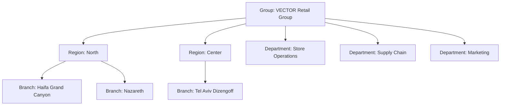
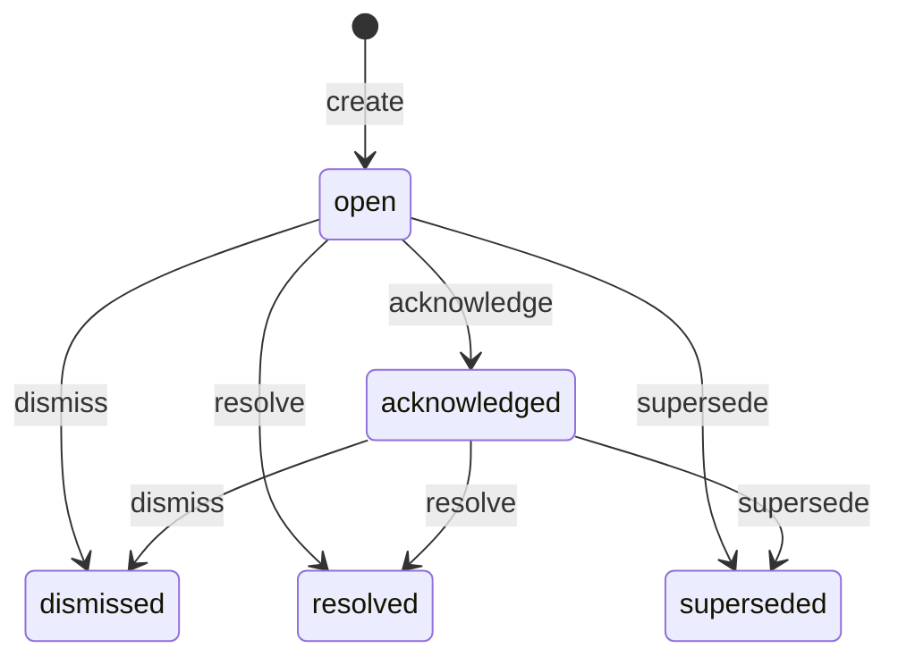
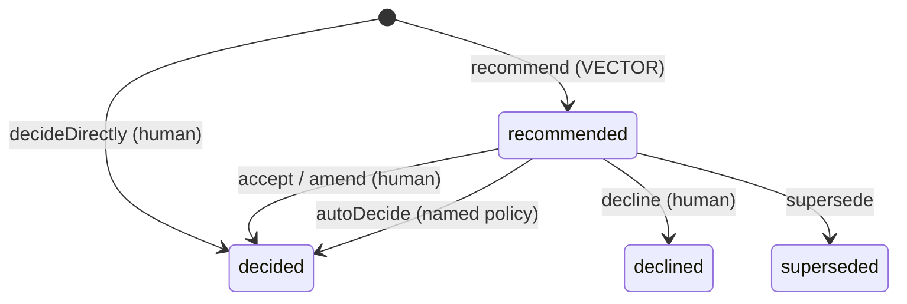
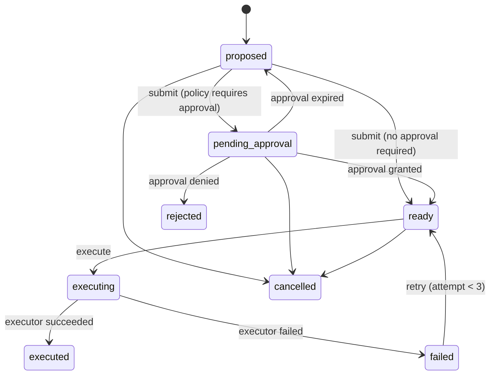
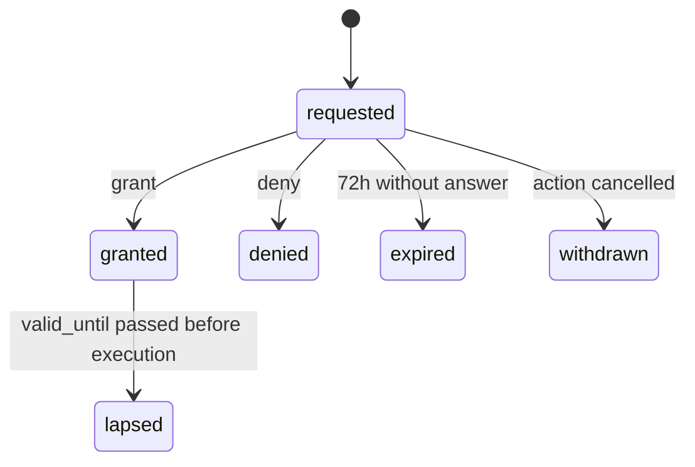
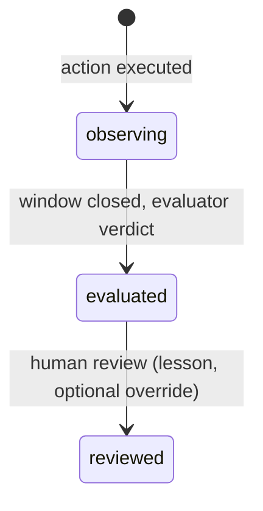

# Domain model and lifecycle

Status: **Draft for Phase 1 approval**. Phase 2 implements this verbatim; every transition row below becomes
a test case.

VECTOR's model is the lifecycle **Signal → Insight → Decision → Action → Outcome**, placed in an
organization and wrapped by governance records (Evidence, Approval, AuditEvent). Entities are introduced
only when a phase needs them (charter §25).

## 1. Organization

| Entity           | Purpose                                                                            | Key fields                                                                                | Phase |
| ---------------- | ---------------------------------------------------------------------------------- | ----------------------------------------------------------------------------------------- | ----- |
| `Organization`   | Tenant boundary. Every row carries `org_id`, even though the prototype has one org | name                                                                                      | P2    |
| `OrgUnit`        | Node in one tree: `group`, `region`, `branch`, `department`                        | type, parent_id, name, code, geo (branches: lat/lon, city), size_class                    | P2    |
| `User`           | A person who signs in                                                              | name, email, title, is_seeded                                                             | P2    |
| `RoleAssignment` | A role held at an org unit; scope = that unit's subtree                            | user_id, role, org_unit_id                                                                | P2    |
| `Kpi`            | Metric definition                                                                  | code, name, unit, direction (higher_is_better), strategic_weight 0–1, owner_department_id | P2    |
| `KpiObservation` | One value of a KPI for a unit and day                                              | kpi_id, org_unit_id, date, value, source                                                  | P2    |

Branches belong to regions. Departments sit under the group and relate to branches through **service
relationships** (Supply Chain serves all branches). In Phase 4 these become explicit `Dependency` rows; until then
an insight lists departments among its affected units when a detector says so.

## 2. Lifecycle entities

| Entity       | What it is                                                      | Key fields                                                                                                                                                                                                                                                               | Mutable?        |
| ------------ | --------------------------------------------------------------- | ------------------------------------------------------------------------------------------------------------------------------------------------------------------------------------------------------------------------------------------------------------------------ | --------------- |
| `Signal`     | A fact: something changed or was observed                       | type (`kpi_deviation`, later `commitment_overdue`, `dependency_delay`, `decision_conflict`, `external_event`), source, detector + detector_version, observed_at, primary_unit_id, measurements (JSON), dedupe_key                                                        | **Immutable**   |
| `Evidence`   | Frozen snapshot of data that supports a claim                   | kind (`kpi_series`, `kpi_point`, `meeting_note`, `external_item`, `computed`), source_ref, captured_at, payload (JSON), payload_hash                                                                                                                                     | **Immutable**   |
| `Insight`    | Interpretation of one or more signals in organizational context | title, what_happened, why_it_matters, primary_unit_id, affected_unit_ids[], signal_ids[], evidence_ids[], confidence 0–1, priority_score, priority_band, priority_breakdown (JSON), priority_model_version, generated_by (`rule:<id>@v` or `ai:<generation_id>`), status | State machine   |
| `Decision`   | What the organization chose to do about an insight              | insight_id, statement, rationale, origin (`vector_recommended`, `human_authored`), status, decided_by (user or policy id), decided_at                                                                                                                                    | State machine   |
| `Action`     | A concrete response with an owner                               | decision_id, type, title, owner_user_id, target_unit_ids[], due_at, estimated_cost, executor (`internal_task`, `outbox_message`), params (JSON), approval_requirement (JSON: rule ids, required role, required scope), idempotency_key, status, attempt                  | State machine   |
| `Approval`   | One explicit human answer on one action                         | action_id, requested_at, required_role, required_scope_unit_id, policy_rule_ids[], approver_user_id, verdict, rationale, decided_at, valid_until, status                                                                                                                 | State machine   |
| `Outcome`    | What happened after the action                                  | action_id, metric (kpi_id + unit), expected_direction, expected_threshold, window_start, window_end, observed (JSON), evidence_ids[], verdict, verdict_by (`evaluator@v` or user), lesson, status                                                                        | State machine   |
| `AuditEvent` | Append-only record of every state change                        | see [authorization.md §6](authorization.md#6-audit-event)                                                                                                                                                                                                                | **Insert-only** |

Later phases add `Commitment` and `Dependency` (P4), `AiGeneration` (P5), `ExternalItem` (P6).

## 3. Rules that hold everywhere

1. **No hidden transitions.** A state field changes only inside a named command (`src/application/commands`).
   The command checks authorization, applies the pure domain transition, and writes the entity change and its
   `AuditEvent` in the **same transaction**. There is no other write path, and code review rejects one.
2. **The domain decides; infrastructure persists.** Transitions are pure functions
   `(entity, command, actor, policyContext, clock) → { next, events } | DomainError` in `src/domain`.
3. **Evidence is frozen.** An insight cites evidence snapshots, never live queries.
4. **Decision origin is explicit and displayed:** recommended by VECTOR, made by a human, or decided by a
   named automatic policy. It is never inferred from other fields.
5. **Approval is a record, not a flag.** An action can execute only if `approval_requirement` is empty or a
   `granted`, unexpired `Approval` exists for that exact action.
6. **Time is injected.** Every timestamp in the domain comes from the `Clock`; the demo clock can advance it.

## 4. State machines and transition tables

Notation: **Actor** = the capability required (see [authorization.md](authorization.md)) or a system actor.
**Guard** = conditions checked by the domain or policy. **Audit** = `operation` written to `AuditEvent`.
Any transition not listed is **rejected** with `IllegalTransition` and audited as a denied attempt.

### 4.1 Insight

| #   | From → To                      | Command              | Actor                                           | Guard                                                                                     | Audit                  |
| --- | ------------------------------ | -------------------- | ----------------------------------------------- | ----------------------------------------------------------------------------------------- | ---------------------- |
| I1  | ∅ → open                       | `createInsight`      | `system:detector` (P2), `system:ai` (P5)        | ≥1 signal, ≥1 evidence, priority computed                                                 | `insight.created`      |
| I2  | open → acknowledged            | `acknowledgeInsight` | `insight.acknowledge`                           | actor's scope contains primary unit                                                       | `insight.acknowledged` |
| I3  | open/acknowledged → dismissed  | `dismissInsight`     | `insight.dismiss`                               | rationale required; no action in `pending_approval`/`ready`/`executing`                   | `insight.dismissed`    |
| I4  | open/acknowledged → resolved   | `resolveInsight`     | `insight.resolve` or `system:outcome-evaluator` | every decision is `decided`/`declined` and every executed action has an evaluated outcome | `insight.resolved`     |
| I5  | open/acknowledged → superseded | `supersedeInsight`   | `system:detector`                               | the new insight covers all signals of the old one                                         | `insight.superseded`   |

Signal deduplication: a detector emitting a signal whose `dedupe_key` matches an open insight's signal **attaches**
it (audit `insight.signal_attached`) and recomputes priority (audit `insight.reprioritized`, before and after
breakdown stored).

### 4.2 Decision

| #   | From → To                | Command                                               | Actor                               | Guard                                                                                                      | Audit                             |
| --- | ------------------------ | ----------------------------------------------------- | ----------------------------------- | ---------------------------------------------------------------------------------------------------------- | --------------------------------- |
| D1  | ∅ → recommended          | `recommendDecision`                                   | `system:detector`, `system:ai` (P5) | insight open/acknowledged; includes ≥1 proposed action                                                     | `decision.recommended`            |
| D2  | ∅ → decided              | `decideDirectly`                                      | `decision.decide`                   | scope contains insight primary unit; rationale required; `origin=human_authored`                           | `decision.decided`                |
| D3  | recommended → decided    | `acceptDecision` (optional amended statement/actions) | `decision.decide`                   | scope check; who/when recorded; amendments diffed in audit                                                 | `decision.decided`                |
| D4  | recommended → decided    | `autoDecide`                                          | `system:policy`                     | an automatic-decision rule (AD-n) matches **and** every resulting action has an empty approval requirement | `decision.auto_decided` (rule id) |
| D5  | recommended → declined   | `declineDecision`                                     | `decision.decide`                   | rationale required                                                                                         | `decision.declined`               |
| D6  | recommended → superseded | `supersedeDecision`                                   | `system:detector`                   | insight superseded                                                                                         | `decision.superseded`             |

Automatic-decision rules (P2 has exactly one):

- **AD-1:** for P3/P4 insights, auto-decide the recommended "notify owner" decision. It only creates an
  `internal_task` informing the unit owner, which needs no approval. P1/P2 insights are **never** auto-decided.

### 4.3 Action (where human control matters most)

| #   | From → To                                   | Command                    | Actor                                                                           | Guard                                                                                                                                                                                                      | Audit                                                   |
| --- | ------------------------------------------- | -------------------------- | ------------------------------------------------------------------------------- | ---------------------------------------------------------------------------------------------------------------------------------------------------------------------------------------------------------- | ------------------------------------------------------- |
| A1  | ∅ → proposed                                | `proposeAction`            | `action.propose` or `system:detector`/`system:ai` (as part of a recommendation) | decision exists; owner set; target units within proposer scope (humans)                                                                                                                                    | `action.proposed`                                       |
| A2  | proposed → pending_approval                 | `submitAction`             | `action.propose` or `system:policy` (when its decision becomes `decided`)       | approval policy evaluated **at submit time**; result stored in `approval_requirement`; an `Approval(requested)` is created                                                                                 | `action.submitted` + `approval.requested`               |
| A3  | proposed → ready                            | `submitAction`             | same as A2                                                                      | policy returns no requirement (rules evaluated and listed, all "not matched")                                                                                                                              | `action.submitted` (requirement: none, rules evaluated) |
| A4  | pending_approval → ready                    | via `grantApproval` (§4.4) | `action.approve`                                                                | see AP guards                                                                                                                                                                                              | `action.approved`                                       |
| A5  | pending_approval → rejected                 | via `denyApproval`         | `action.approve`                                                                | rationale required                                                                                                                                                                                         | `action.rejected`                                       |
| A6  | pending_approval → proposed                 | via `expireApproval`       | `system:clock`                                                                  | request older than 72 h (demo clock). **Silence never approves**                                                                                                                                           | `action.approval_expired`                               |
| A7  | ready → executing                           | `executeAction`            | `system:executor` or `action.execute`                                           | **re-authorization at run time:** approval still `granted` and `valid_until` > now; owner still active; policy re-evaluated, and if the requirement grew, the action goes back to pending_approval instead | `action.execution_started`                              |
| A8  | executing → executed                        | `completeExecution`        | `system:executor`                                                               | idempotency key not already used; executor result stored                                                                                                                                                   | `action.executed`                                       |
| A9  | executing → failed                          | `failExecution`            | `system:executor`                                                               | error stored                                                                                                                                                                                               | `action.failed`                                         |
| A10 | failed → ready                              | `retryAction`              | `action.execute`                                                                | attempt < 3                                                                                                                                                                                                | `action.retried`                                        |
| A11 | proposed/pending_approval/ready → cancelled | `cancelAction`             | `action.cancel` (owner, proposer, or approver scope)                            | rationale required; open approval → `withdrawn`                                                                                                                                                            | `action.cancelled`                                      |

Executors in the prototype (D7) are **simulated and labelled**: `internal_task` creates a task visible in VECTOR,
and `outbox_message` writes a message to the visible outbox instead of sending it.

### 4.4 Approval

| #   | From → To             | Command                 | Actor            | Guard                                                                                                                                                                                                                                            | Audit                                                           |
| --- | --------------------- | ----------------------- | ---------------- | ------------------------------------------------------------------------------------------------------------------------------------------------------------------------------------------------------------------------------------------------ | --------------------------------------------------------------- |
| P1  | ∅ → requested         | (inside `submitAction`) | `system:policy`  | —                                                                                                                                                                                                                                                | `approval.requested`                                            |
| P2  | requested → granted   | `grantApproval`         | `action.approve` | approver is eligible under **every** matched approval rule (authorization.md §4); approver ≠ proposer; approver ≠ action owner; the session is a real signed-in user (persona switcher allowed, flagged); explicit click with rationale optional | `approval.granted`                                              |
| P3  | requested → denied    | `denyApproval`          | `action.approve` | same scope guards; rationale **required**                                                                                                                                                                                                        | `approval.denied`                                               |
| P4  | requested → expired   | `expireApproval`        | `system:clock`   | now − requested_at > 72 h                                                                                                                                                                                                                        | `approval.expired`                                              |
| P5  | requested → withdrawn | (inside `cancelAction`) | —                | —                                                                                                                                                                                                                                                | `approval.withdrawn`                                            |
| P6  | granted → lapsed      | `lapseApproval`         | `system:clock`   | valid_until (granted_at + 7 days) passed and action not executed                                                                                                                                                                                 | `approval.lapsed`; action → pending_approval with a new request |

An approval belongs to **one action version**. If an action's params, targets or cost change after approval,
the approval is withdrawn and a new one is requested. A previous approval of a _similar_ action never counts.

### 4.5 Outcome

| #   | From → To             | Command                                          | Actor                      | Guard                                                                                                             | Audit                                                                                       |
| --- | --------------------- | ------------------------------------------------ | -------------------------- | ----------------------------------------------------------------------------------------------------------------- | ------------------------------------------------------------------------------------------- |
| O1  | ∅ → observing         | `startOutcomeWatch` (inside `completeExecution`) | `system:executor`          | action type defines metric, expected direction, threshold and window (default 7 days)                             | `outcome.watch_started`                                                                     |
| O2  | observing → evaluated | `evaluateOutcome`                                | `system:outcome-evaluator` | window_end ≤ now; observations frozen as evidence                                                                 | `outcome.evaluated` (verdict: `worked`, `partially_worked`, `did_not_work`, `inconclusive`) |
| O3  | evaluated → reviewed  | `reviewOutcome`                                  | `outcome.review`           | scope contains target units; an override of the verdict needs a rationale and keeps the original verdict in audit | `outcome.reviewed`                                                                          |

Verdict rule (deterministic, P2): compare the post-window mean of the metric to the pre-action baseline.
`worked` if the change in the expected direction is ≥ the threshold; `partially_worked` if ≥ 50% of it;
`did_not_work` otherwise; `inconclusive` if data coverage < 80% of window days.

**Learning (D6)** in Phase 2 = outcome verdicts and human lessons, queryable per action type. AI-proposed
adjustments to priority weights and playbooks (themselves approved through this same Approval mechanism)
arrive in Phases 4–5.

## 5. Mapping to the charter's ten questions

| Charter question                      | Answered by                                                      |
| ------------------------------------- | ---------------------------------------------------------------- |
| What happened?                        | Insight.what_happened + Signal measurements                      |
| Why does it matter?                   | Insight.why_it_matters + priority breakdown                      |
| Who or what is affected?              | Insight.affected_unit_ids                                        |
| How important is it?                  | priority_score / band + breakdown                                |
| What should we do?                    | Decision (recommended) + proposed Actions                        |
| Who should act?                       | Action.owner_user_id                                             |
| What dependencies or approvals exist? | Action.approval_requirement + Approval (P4: Dependency)          |
| What happened after the action?       | Outcome.observed                                                 |
| Did it work?                          | Outcome.verdict                                                  |
| What should we learn?                 | Outcome.lesson (P2), approved weight/playbook adjustments (P4–5) |
