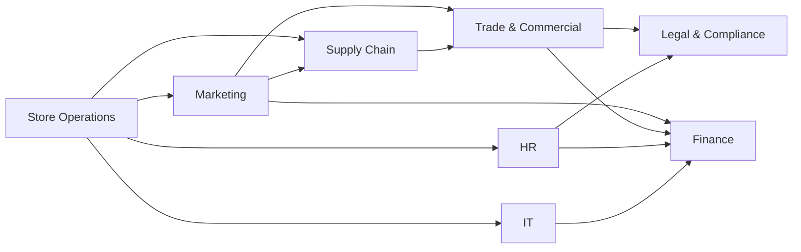

# Scenario catalog: cross-department stories

Status: **Approved with Phase 1 (amendment, 2026-10-04)**. These are the planted stories the synthetic organization
carries from Phase 3 onwards (Phase 2 uses only P2-S1). Each scenario touches several departments, and most are
linked to each other through shared dependencies. That is the "organizational coordination" VECTOR has to show
(charter Objective 4).

## Departments (8)

| Department         | Owns                                                                          | Typical signals                            |
| ------------------ | ----------------------------------------------------------------------------- | ------------------------------------------ |
| Store Operations   | branches' day-to-day execution, staffing on the floor                         | OSA, sales, NPS, shrinkage                 |
| Supply Chain       | DCs, transport, replenishment                                                 | delivery delays, fill rate                 |
| Trade & Commercial | buying, suppliers, pricing, category management, promotions' commercial terms | cost changes, margin, delistings           |
| Marketing          | campaigns, customer communication, promo execution                            | campaign readiness, redemption             |
| Finance            | budget, forecast, cash, spend control                                         | budget variance, margin forecast           |
| HR                 | workforce, pay, rostering, training                                           | labor cost, vacancies, training completion |
| Legal & Compliance | regulation, contracts, recalls, privacy                                       | regulatory deadlines, contract clauses     |
| IT                 | systems, POS, data, change management                                         | outages, rollout schedules, incidents      |

Customer Experience (in the earlier draft) is folded into Store Operations and Marketing; Merchandising & Buying is
renamed **Trade & Commercial** as requested.

## Dependency map

Arrows read "depends on": a delay or change in the target ripples to the source.

## Scenarios

Each row lists the departments involved, the dependency chain the scenario exercises, and its calibration scenario
in [priority-scenarios.json](priority-scenarios.json).

### C1 · Supplier cost increase meets a planned promotion (S11, expected P2)

- **Trigger:** a key dairy supplier notifies Trade & Commercial of a 7% cost increase on 120 SKUs, effective in 10 days.
- **Chain:** Trade & Commercial → Finance (margin forecast drops ₪250k/week) → Marketing (a promo on 30 of those SKUs is
  already scheduled at the old cost) → Legal & Compliance (the contract has a 30-day price-protection clause) → Store
  Operations (shelf price changes in 60 branches).
- **VECTOR shows:** one insight that links the cost signal, the promo conflict and the contract clause; it recommends that
  Legal invoke price protection, that Trade renegotiate, and that the promo be held until terms are settled.
- **Approvals:** supplier communication → AP-1 (external) · invoking a contract clause → AP-7 (Legal).

### C2 · Food-safety recall (S12, expected P1)

- **Trigger:** a supplier recalls one batch of a chilled product.
- **Chain:** Legal & Compliance (regulator notification due within 24 h) → Supply Chain (quarantine the stock at the DC)
  → Store Operations (pull it from shelves in 60 branches within 12 h) → IT (block the SKU at POS) → Marketing (pause the
  promo, then customer notice) → Finance (write-off and supplier claim).
- **VECTOR shows:** a P1 with a per-branch removal checklist; the outcome is "% of branches confirmed clear within 12 h".
- **Approvals:** regulatory notification → AP-7 · customer notice → AP-1 · group-wide scope → AP-2 (Executive).

### C3 · POS upgrade scheduled inside the holiday peak (S13, expected P2)

- **Trigger:** IT's rollout plan puts the POS upgrade for 60 branches in the two weeks before the holiday.
- **Chain:** IT → Store Operations (peak trading, store staff need training) → HR (training sessions not booked) → Marketing
  (holiday campaign drives peak traffic) → Finance (payment reconciliation during the cut-over).
- **VECTOR shows:** a `decision_conflict` between IT's change window and the peak calendar; it recommends moving the
  rollout after the holiday or piloting 5 branches.
- **Approvals:** cross-department schedule change touching > 1 region → AP-2 (Executive).

### C4 · New wage rule, overdue pay tables (S14, expected P2)

- **Trigger:** a (synthetic) wage rule takes effect in 30 days. In the weekly ops meeting HR committed to updated pay
  tables; that commitment is now 5 days overdue.
- **Chain:** HR (pay tables, rosters) → Legal & Compliance (compliance by the effective date) → Finance (labor budget
  +₪120k/week to re-forecast) → Store Operations (rosters and hours).
- **VECTOR shows:** a `commitment_overdue` signal linked to a compliance deadline, ranked by the overdue date rather than
  the effective date.
- **Approvals:** staffing changes → AP-6 · budget re-forecast ≥ ₪50k → AP-3 (Executive).

### C5 · Spend freeze vs. a committed campaign (S15, expected P2)

- **Trigger:** Finance freezes discretionary spend for Q4 after an IT project and two refurbishments overran capex.
- **Chain:** Finance → Marketing (₪350k Q4 campaign already committed with the agency) → Legal & Compliance (agency
  contract cancellation terms) → Trade & Commercial (supplier co-funding tied to the campaign) → IT (the overrunning project).
- **VECTOR shows:** two departments' decisions in direct conflict, with the cost of each resolution; the decision is routed
  to the CEO.
- **Approvals:** cross-department decision ≥ ₪50k → AP-3 (Executive).

### Earlier scenarios, now with their cross-department links

| Scenario                                      | Departments                                        | Calibration |
| --------------------------------------------- | -------------------------------------------------- | ----------- |
| North stock-outs before the holiday weekend   | Store Operations, Supply Chain, Trade & Commercial | S02 (P1)    |
| DC delay cascading to 14 branches             | Supply Chain, Store Operations, Marketing          | S04 (P1)    |
| Promo assets 3 days late (meeting commitment) | Marketing, Store Operations, Supply Chain          | S06 (P1)    |
| Promo vs. delisting conflict                  | Marketing, Trade & Commercial                      | S07 (P3)    |
| Heatwave opportunity (live external data)     | Store Operations, Supply Chain, Marketing          | S08 (P2)    |
| Labor cost over plan, Center                  | Store Operations, HR, Finance                      | S05 (P3)    |

## Why this set

- Every department appears in at least three scenarios, and every scenario involves at least three departments.
- The five charter scenario types (§36) are all covered: KPI anomaly (S02), meeting commitment (C4, S06), conflicting
  decision (C3, C5, S07), external event (S08), cross-department dependency (C1, C2, S04).
- C1 and C5 share Marketing's campaign, C2 and C3 share the holiday peak, and C4 and S05 share labor cost. Linked stories let
  the demo show one change rippling across the organization rather than isolated alerts.
