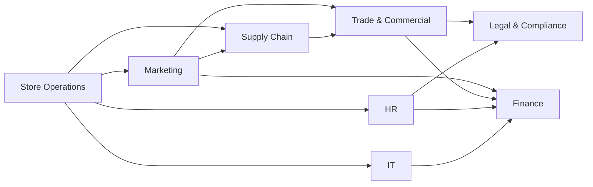

# Scenario catalog

Status: **Approved with Phase 1, revised 2026-10-04** after Eran's review: compliance factor added (priority-v2),
local (scope-relative) priority added, and opportunities split into their own workstream. Scores come from
`pnpm exec tsx scripts/calibrate-priority.ts`; inputs live in [priority-scenarios.json](priority-scenarios.json).

There are two workstreams, managed separately (ADR-006):

- **Risk workstream:** things that threaten results, compliance or operations. Scored with `priority-v2`, bands
  **P1–P4**. 14 scenarios.
- **Opportunity workstream:** upside to capture before a window closes. Scored with `opportunity-v1`, bands
  **O1–O3**. 5 scenarios.

They share the lifecycle (Signal → Insight → Decision → Action → Outcome), the approval rules and the audit.
They are never ranked against each other, and each has its own lane in every view.

## Departments (8)

| Department         | Owns                                                                   | Typical signals                                   |
| ------------------ | ---------------------------------------------------------------------- | ------------------------------------------------- |
| Store Operations   | day-to-day branch execution, floor staffing, customer experience       | OSA, sales, NPS, shrinkage                        |
| Supply Chain       | DCs, transport, replenishment                                          | delivery delays, fill rate                        |
| Trade & Commercial | buying, suppliers, pricing, categories, commercial terms of promotions | cost changes, margin, delistings, supplier offers |
| Marketing          | campaigns, customer communication, promo execution                     | campaign readiness, redemption, traffic           |
| Finance            | budget, forecast, cash, spend control                                  | budget variance, margin forecast, cash            |
| HR                 | workforce, pay, rostering, training                                    | labor cost, vacancies, training completion        |
| Legal & Compliance | regulation, contracts, recalls, privacy                                | regulatory deadlines, contract clauses            |
| IT                 | systems, POS, data, change management                                  | outages, rollout schedules, incidents             |

## Department dependency map

Read an arrow as "depends on": a delay or change at the arrow's end ripples back to its start.

## Scenario × department matrix

● = owns the response · ○ = affected or must act

| Scenario                                     | WS   | Org band | Store Ops | Supply | Trade & Comm. | Marketing | Finance | HR  | Legal | IT  |
| -------------------------------------------- | ---- | -------- | :-------: | :----: | :-----------: | :-------: | :-----: | :-: | :---: | :-: |
| R1 Food-safety recall (S12)                  | Risk | P1 91.7  |     ○     |   ○    |               |     ○     |    ○    |     |   ●   |  ○  |
| R2 DC delay cascade (S04)                    | Risk | P1 77.0  |     ○     |   ●    |               |     ○     |    ○    |     |       |     |
| R3 North stock-outs before holiday (S02)     | Risk | P1 72.3  |     ○     |   ●    |       ○       |           |    ○    |     |       |     |
| R4 Promo assets late (S06)                   | Risk | P1 68.7  |     ○     |   ○    |       ○       |     ●     |         |     |       |     |
| R5 Wage rule, pay tables overdue (S14)       | Risk | P2 64.8  |     ○     |        |               |           |    ○    |  ●  |   ○   |     |
| R6 Supplier cost vs. planned promo (S11)     | Risk | P2 59.4  |     ○     |        |       ●       |     ○     |    ○    |     |   ○   |     |
| R7 Spend freeze vs. committed campaign (S15) | Risk | P2 59.4  |           |        |       ○       |     ○     |    ●    |     |   ○   |  ○  |
| R8 Haifa Grand Canyon sales drop (S01)       | Risk | P2 57.8  |     ●     |   ○    |               |           |         |     |       |     |
| R9 POS upgrade inside holiday peak (S13)     | Risk | P2 54.1  |     ○     |        |               |     ○     |    ○    |  ○  |       |  ●  |
| R10 Single-branch shrinkage spike (S09)      | Risk | P3 48.5  |     ●     |        |               |           |    ○    |  ○  |   ○   |     |
| R11 Labor cost over plan, Center (S05)       | Risk | P3 46.2  |     ●     |        |               |           |    ○    |  ○  |       |     |
| R12 Promo vs. delisting conflict (S07)       | Risk | P3 43.9  |     ○     |   ○    |       ●       |     ●     |         |     |       |     |
| R13 POS outage, resolved (S10)               | Risk | P4 32.1  |     ○     |        |               |           |    ○    |     |       |  ●  |
| R14 Branch NPS down (S03)                    | Risk | P4 30.3  |     ●     |        |               |     ○     |         |  ○  |       |     |
| O1 Heatwave demand, South (OP1)              | Opp. | O1 64.0  |     ●     |   ○    |               |     ○     |         |  ○  |       |     |
| O2 Competitor closure near Ramat Gan (OP2)   | Opp. | O2 45.7  |     ○     |   ○    |               |     ●     |    ○    |  ○  |       |     |
| O3 Supplier overstock offer (OP3)            | Opp. | O2 48.0  |           |   ○    |       ●       |     ○     |    ○    |     |   ○   |     |
| O4 Click-and-collect surge, Center (OP4)     | Opp. | O2 55.5  |     ○     |        |               |     ○     |         |  ○  |       |  ●  |
| O5 Unused space, Petah Tikva (OP5)           | Opp. | O3 19.5  |     ●     |        |       ○       |           |    ○    |     |   ○   |     |

Every department owns at least one scenario and is involved in at least four. Every scenario involves at least two
departments, and all but one (R8) involve three or more.

## Risk workstream

Factor order in each card: magnitude · impact · breadth · urgency · strategic · compliance (weights 0.15 · 0.20 · 0.10 ·
0.15 · 0.30 · 0.10). "Local" is the scope-relative priority a regional or branch manager sees for their own scope.

### R1 · Food-safety recall: P1 91.7 (S12)

- **Trigger:** a supplier recalls one batch of a chilled product. Signal: `external_event` / supplier notice.
- **Chain:** Legal & Compliance (regulator notice within 24 h) → Supply Chain (quarantine at the DC) → Store Operations (off
  shelves in 60 branches within 12 h) → IT (block the SKU at POS) → Marketing (pause the promo, customer notice) → Finance
  (write-off, supplier claim).
- **Factors:** 1.00 · 0.68 · 1.00 · 1.00 · 1.00 · 1.00 (compliance: regulator-mandated action).
- **Approvals:** regulatory notice AP-7 · customer notice AP-1 · group-wide AP-2 (CEO).
- **Outcome:** % of branches confirmed clear within 12 h; regulator notified in time.

### R2 · DC delivery delay cascading to 14 branches: P1 77.0 (S04)

- **Trigger:** the North DC misses two delivery waves. Signal: `dependency_delay`.
- **Chain:** Supply Chain → Store Operations (14 branches in North and Center short of fresh stock) → Marketing (promo items
  not on shelf) → Finance (lost sales).
- **Factors:** 0.75 · 0.85 · 1.00 · 1.00 · 0.90 · 0.00.
- **Approvals:** reroute via the Center DC, ₪30k, two regions → AP-2 (CEO) + AP-3.
- **Outcome:** on-time delivery and OSA back to baseline within 3 days.

### R3 · North stock-outs before the holiday weekend: P1 72.3 (S02)

- **Trigger:** OSA on the top-50 SKUs falls to 91% across 9 North branches, 48 h before the holiday. Signal: `kpi_deviation`.
- **Chain:** Store Operations ← Supply Chain (allocation) ← Trade & Commercial (supplier fill rate); Finance (sales at stake).
- **Factors:** 0.88 · 0.90 · 0.75 · 0.75 · 0.90 · 0.00.
- **Approvals:** inventory transfer AP-4 + P1 AP-5 → Regional Manager North (the investor demo's approval moment).
- **Outcome:** OSA ≥ 96% within 7 days.

### R4 · Promo assets 3 days late, launch in 2 days: P1 68.7 (S06)

- **Trigger:** a commitment from the weekly ops meeting (Marketing to deliver signage to 60 branches) is overdue.
  Signal: `commitment_overdue`.
- **Chain:** Marketing (agency late) → Store Operations (60 branches can't set up) → Supply Chain (promo stock already
  shipped) → Trade & Commercial (supplier co-funding depends on in-store execution).
- **Factors:** 0.63 · 0.77 · 1.00 · 0.75 · 0.80 · 0.00.
- **Approvals:** escalation to the agency (external) AP-1; group-wide AP-2 (CEO).
- **Outcome:** % of branches with assets in place at launch.

### R5 · New wage rule, HR's pay tables 5 days overdue: P2 64.8 (S14)

- **Trigger:** a (synthetic) wage rule takes effect in 30 days; HR committed to pay tables and is 5 days late.
  Signal: `commitment_overdue` + compliance deadline.
- **Chain:** HR → Legal & Compliance (compliance by the effective date) → Finance (labor re-forecast +₪120k/week) →
  Store Operations (rosters).
- **Factors:** 0.50 · 0.60 · 1.00 · 1.00 · 0.50 · 0.80. **Stays P2 by Eran's decision**; this is why the compliance weight is
  0.10 (at 0.15 it would become P1).
- **Approvals:** staffing AP-6; re-forecast ≥ ₪50k AP-3 (CEO).
- **Outcome:** pay tables published and rosters compliant before the effective date.

### R6 · Supplier cost increase meets a planned promotion: P2 59.4 (S11)

- **Trigger:** a key dairy supplier raises cost 7% on 120 SKUs in 10 days. Signal: `external_event` (supplier notice).
- **Chain:** Trade & Commercial → Finance (margin −₪250k/week) → Marketing (promo on 30 of those SKUs at the old cost) →
  Legal & Compliance (30-day price-protection clause) → Store Operations (shelf prices).
- **Factors:** 0.63 · 0.74 · 1.00 · 0.25 · 0.70 · 0.30 (contractual terms at stake).
- **Approvals:** supplier communication AP-1; invoking the clause AP-7.
- **Outcome:** margin protected; promo either repriced or held.

### R7 · Spend freeze vs. a committed campaign: P2 59.4 (S15)

- **Trigger:** Finance freezes Q4 discretionary spend after an IT project and two refurbishments overran.
  Signal: `decision_conflict`.
- **Chain:** Finance → Marketing (₪350k campaign already committed) → Legal & Compliance (agency cancellation terms) →
  Trade & Commercial (supplier co-funding) → IT (the overrunning project).
- **Factors:** 0.38 · 0.80 · 1.00 · 0.50 · 0.70 · 0.30.
- **Approvals:** cross-department decision ≥ ₪50k → AP-3 (CEO).
- **Outcome:** one resolved decision; cost of the chosen path versus the alternative.

### R8 · Haifa Grand Canyon net sales −18%: P2 57.8, local P1 72.7 (S01) — the Phase 2 demo

- **Trigger:** sales 18% below the usual level for a week; OSA fell first. Signal: `kpi_deviation` (detector v1, live).
- **Chain:** Store Operations ← Supply Chain (a DC routing change dropped two categories).
- **Factors:** 0.70 · 0.60 · 0.25 · 0.75 · 0.80 · 0.00. Local for the branch manager: impact 1.00 (10% of the branch's sales),
  breadth 1.00 → P1.
- **Approvals:** inventory transfer AP-4 → Regional Manager North or the VP Supply Chain (owner excluded).
- **Outcome:** OSA up ≥ 5 points within 7 days (the live demo shows "worked").

### R9 · POS upgrade scheduled inside the holiday peak: P2 54.1 (S13)

- **Trigger:** IT plans the POS upgrade for 60 branches in the two weeks before the holiday. Signal: `decision_conflict`.
- **Chain:** IT → Store Operations (peak trading, training) → HR (sessions not booked) → Marketing (campaign traffic) →
  Finance (payment reconciliation during cut-over).
- **Factors:** 0.50 · 0.83 · 1.00 · 0.25 · 0.60 · 0.30. **Stays P2 by Eran's decision.**
- **Approvals:** schedule change across regions → AP-2 (CEO).
- **Outcome:** no POS cut-over inside the peak, or a 5-branch pilot only.

### R10 · Single-branch shrinkage spike: P3 48.5, local P2 60.4 (S09)

- **Trigger:** shrinkage at one branch 3.5σ above normal. Signal: `kpi_deviation`.
- **Chain:** Store Operations → Legal & Compliance (police report, evidence handling) → HR (staff interviews) → Finance
  (write-off).
- **Factors:** 0.88 · 0.39 · 0.25 · 0.75 · 0.60 · 0.00. **For the store manager it is P2** (₪40k is ~4% of the branch's
  weekly sales and the whole of their scope), while it remains P3 for management, as Eran asked.
- **Approvals:** extra security staffing AP-6.
- **Outcome:** shrinkage back within 1σ in 4 weeks.

### R11 · Labor cost 6% over plan, Center: P3 46.2, local P3 40.3 (S05)

- **Trigger:** labor % of sales above plan across 12 branches for 3 weeks. Signal: `kpi_deviation`.
- **Chain:** Store Operations → HR (rosters) → Finance (budget).
- **Factors:** 0.55 · 0.55 · 0.75 · 0.50 · 0.50 · 0.00.
- **Open question:** I expected P2 locally for the Center regional manager; the model says P3 because ₪90k is 0.7% of the
  region's weekly sales. The fixture records P3 pending Eran's call.
- **Approvals:** rostering changes AP-6.

### R12 · Promo vs. delisting conflict: P3 43.9 (S07)

- **Trigger:** Marketing schedules a promo on items Trade & Commercial is delisting. Signal: `decision_conflict`.
- **Chain:** Marketing ↔ Trade & Commercial; Supply Chain (remaining stock); Store Operations (shelf space).
- **Factors:** 0.50 · 0.52 · 0.50 · 0.25 · 0.70 · 0.00.
- **Approvals:** none matched by default; the decision is routed to both department managers, escalating to the CEO if unresolved.

### R13 · 2-hour POS outage, already resolved: P4 32.1, local P3 40.2 (S10)

- **Trigger:** a POS outage at one branch, fixed. Signal: incident record.
- **Chain:** IT → Store Operations → Finance (reconciliation).
- **Factors:** 1.00 · 0.09 · 0.25 · 0.10 · 0.40 · 0.00. Shows that unusual ≠ important: the biggest z-score, ranked near the bottom.

### R14 · Branch NPS down 4 points: P4 30.3, local P3 39.1 (S03)

- **Trigger:** NPS at one branch below its range for 2 weeks. Signal: `kpi_deviation`.
- **Chain:** Store Operations → HR (service training) → Marketing (customer follow-up).
- **Factors:** 0.40 · 0.21 · 0.25 · 0.25 · 0.60 · 0.00.

## Opportunity workstream

Scored with `opportunity-v1`. Factor order: value · window · reach · strategic fit · ease (weights 0.30 · 0.25 · 0.10 · 0.20 ·
0.15); bands **O1 ≥ 60** pursue now · **O2 ≥ 33** plan and resource · **O3** watch.

### O1 · Heatwave in the South in 3 days: beverage and ice-cream demand: O1 64.0 (OP1)

- **Trigger:** a live weather forecast (Open-Meteo, Phase 6) for 8 South branches. Signal: `external_event`.
- **Chain:** Store Operations (owns) → Supply Chain (extra deliveries) → Marketing (local push) → HR (extra staff).
- **Factors:** 0.64 · 0.75 · 0.75 · 0.70 · 0.88 · value ₪150k, cost ₪20k, confidence 0.7.
- **Approvals:** staffing AP-6; cost ≥ ₪10k AP-3 → Regional Manager South.
- **Outcome:** beverage sales uplift versus forecast-matched days.

### O2 · Competitor store near Ramat Gan Ayalon closes in 3 weeks: O2 45.7 (OP2)

- **Trigger:** external news; customers will look for a new store. Signal: `external_event`.
- **Chain:** Marketing (owns: local campaign) → Store Operations (capacity) → HR (staffing) → Supply Chain (volume) →
  Finance (campaign budget).
- **Factors:** 0.55 · 0.25 · 0.50 · 0.80 · 0.72 · value ₪90k/week, cost ₪35k, confidence 0.6.
- **Approvals:** campaign (external) AP-1; cost AP-3.
- **Outcome:** new loyalty sign-ups and sales uplift at Ramat Gan Ayalon.

### O3 · Supplier overstock offer, 25% off, expires in 5 days: O2 48.0 (OP3)

- **Trigger:** a supplier offers two categories at 25% off for volume. Signal: `external_event` (supplier offer).
- **Chain:** Trade & Commercial (owns) → Finance (₪200k cash) → Supply Chain (storage, distribution) → Marketing (promo
  to sell it through) → Legal & Compliance (terms).
- **Factors:** 0.47 · 0.50 · 1.00 · 0.50 · 0.23 · value ₪60k margin, cost ₪200k, confidence 0.9.
- **Approvals:** ≥ ₪50k AP-3 (CEO); contract AP-7.
- **Outcome:** margin captured after sell-through; stock cleared in 6 weeks.

### O4 · Click-and-collect orders +40% in Center: O2 55.5 (OP4)

- **Trigger:** online pickup orders up 40% for 4 weeks, ahead of the holiday. Signal: `kpi_deviation` (positive).
- **Chain:** IT (owns: slot capacity) → Store Operations (pickup points) → HR (pickers) → Marketing (promote slots).
- **Factors:** 0.50 · 0.25 · 0.75 · 0.90 · 0.82 · value ₪70k/week, cost ₪15k, confidence 0.85.
- **Approvals:** staffing AP-6; cost AP-3.
- **Outcome:** slot fill rate and online sales over the holiday weeks.

### O5 · 300 m² unused at Petah Tikva: O3 19.5 (OP5)

- **Trigger:** a space-utilization review finds unused floor space. Signal: facility data.
- **Chain:** Store Operations (owns) → Legal & Compliance (lease) → Finance (income) → Trade & Commercial (partner fit).
- **Factors:** 0.03 · 0.10 · 0.25 · 0.40 · 0.55 · value ₪6k/week, cost ₪5k, confidence 0.7.
- **Approvals:** lease contract AP-7.

## How the stories link

Linked stories show one change rippling through the organization:

- R6 and R7 share Marketing's campaign.
- R1, R9 and O4 share the holiday peak.
- R5 and R11 share labor cost.
- R2, R3 and R8 share the DC.
- O1 runs alongside R3 in the investor demo, so one screen shows a risk and an opportunity in their separate lanes.

## Coverage

- The five charter scenario types (§36) are all covered: KPI anomaly (R3, R8), meeting commitment (R4, R5), conflicting
  decision (R7, R9, R12), external event (R1, O1, O2), cross-department dependency (R2, R6).
- There are four decoys in the synthetic data (noise spikes, R13's resolved outage), to prove VECTOR doesn't cry wolf.
